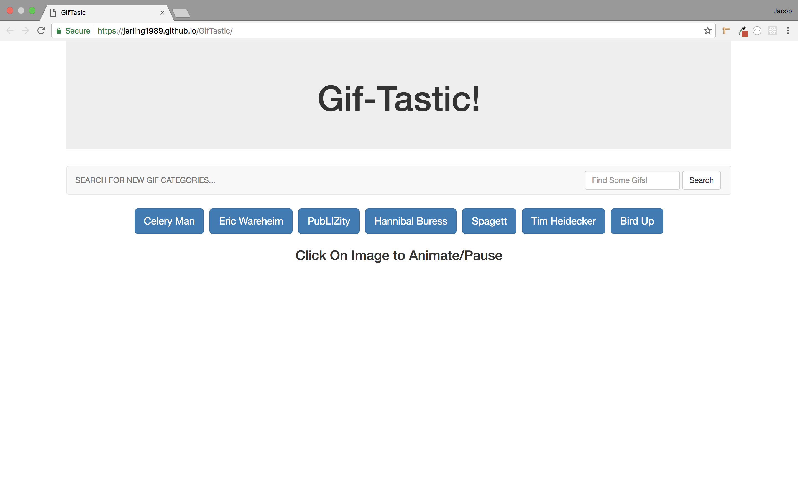
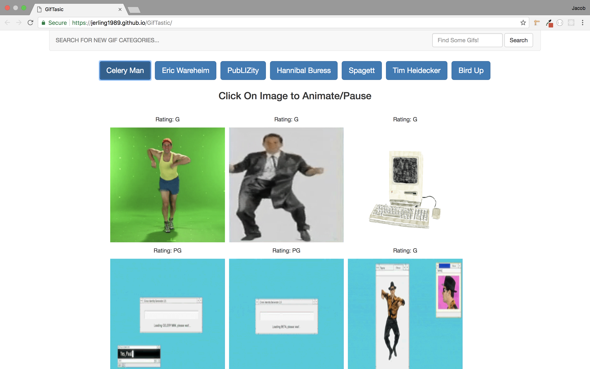
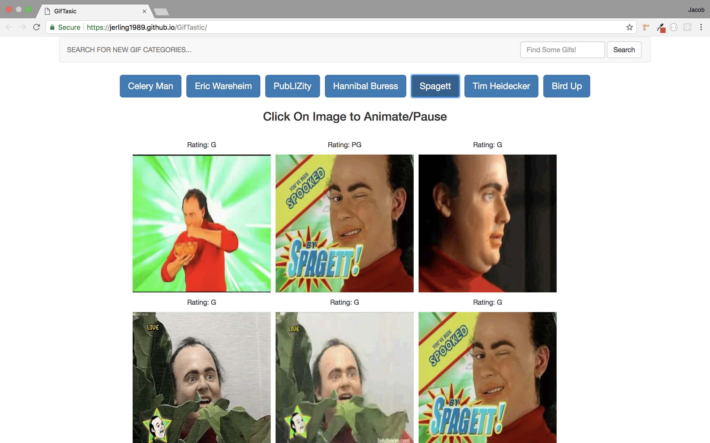
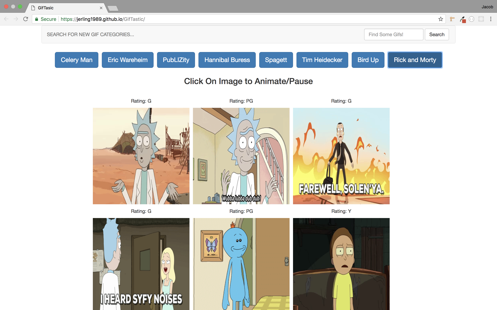

# GifTastic
This is a fun app working with the Giphy API. The code used to build this app is HTML, Bootstrap CSS, jQuery, and AJAX. The page loads with some buttons the user can click on to load some Gifs regarding that topic. The user can then click on the gifs to play of pause them. They can also add more topics by filling out the form at the top of the page.

---

